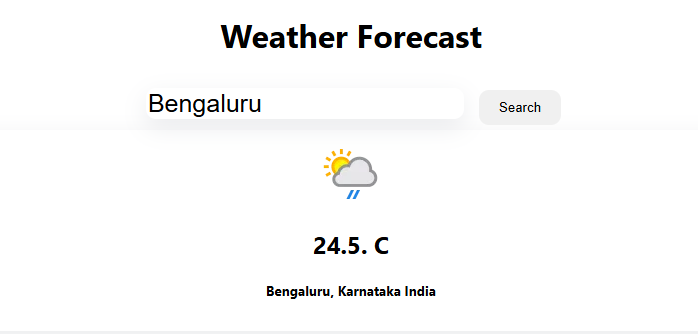

# WeatherApp
[](https://github.com/Khemchand992/WeatherApp)

## Overview
WeatherApp is a simple, beautiful, and responsive web application that provides real-time weather forecasts for any city. The app is built using ReactJS and leverages the OpenWeather API to fetch weather. Users can either search for a city or allow location access to view their local weather conditions.

## Built using:
- [ReactJS: ](https://reactjs.org/) JavaScript library for building user interfaces
- [OpenWeather API: ](https://openweathermap.org/api) API for fetching real-time weather data
- [Context API: ](https://reactjs.org/docs/context.html) For managing global state in React applications
- [CSS3: ](https://developer.mozilla.org/en-US/docs/Web/CSS) For styling and responsiveness

## Pipeline:
### 1. Weather App
This app is responsible for fetching real-time weather data and displaying it to users in a visually appealing manner.
- **Fetching Weather Data**: Uses the OpenWeather API to get weather details based on user input or geolocation.
- **State Management**: Uses React’s Context API to manage and pass state across components.
- **Styling**: The app is styled with modern CSS to ensure a clean, minimalistic design.

### Key Features:
1. Search for any city worldwide.
2. Display current weather, including temperature.
3. Automatically detect the user's location and display the weather (if permission is granted).

## How to run model:
- Fetch the weather data by providing a city name or allowing location access.
- The app will automatically update and display the real-time weather for the selected city or detected location.

## How to run project:
-Install Node.js on your system
- Clone the repository
```bash
git clone https://github.com/Khemchand992/WeatherApp.git
cd WeatherApp
npm install
REACT_APP_WEATHER_API_KEY=your_api_key
npm start
```



